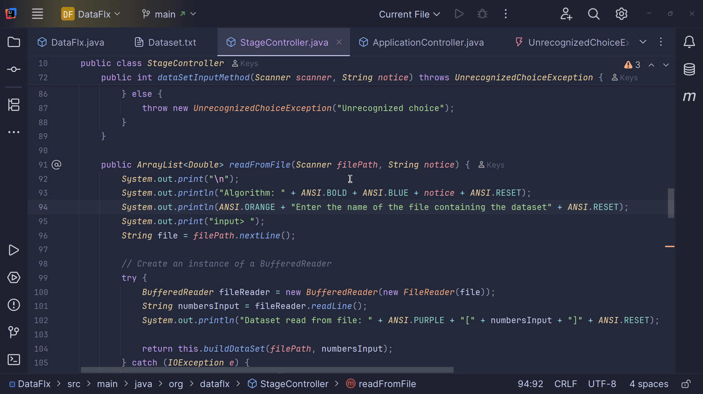

# 🔍📊 DataFlx – Search & Sort CLI (Java)

**DataFlx** is a lightweight ⚡ Java-based command-line application that empowers users to:

---

### 🔎 Search Algorithms
- Linear Search
- Binary Search

### 🌀 Sort Algorithms
- Bubble Sort
- Merge Sort
- Quick Sort

### 🧮 Dataset Input
- Enter custom datasets (numbers or strings) manually
- 📂 **Read dataset from a `.txt` file** (only comma- or space-separated values supported)

### 📈 Get Instant Results
- View output immediately
- Optionally trace step-by-step algorithm execution

---

## 🎯 Ideal For:
- 👨‍🎓 **Students** learning algorithm fundamentals
- 👩‍💻 **Developers** needing quick CLI tools for sort/search tasks
- 🧠 **Enthusiasts** curious about how classic algorithms work under the hood

---

## 📁 Supports Reading from file
- Only `.txt` files are supported
- Values must be separated by **commas** or **spaces**
- **Newline-separated values are not supported**

## 📸Screenshot
