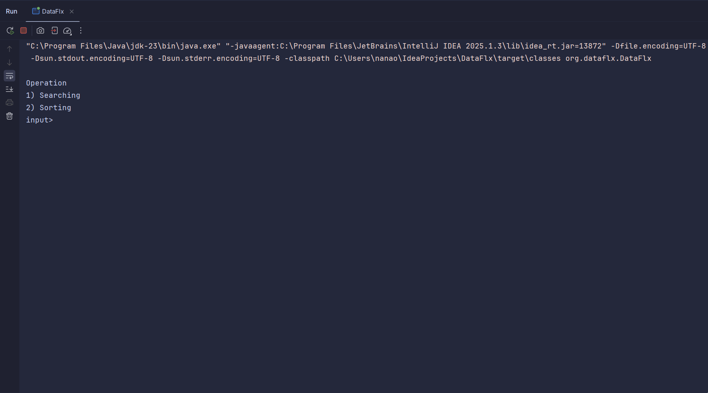

# 🔍📊 DataFlx – Search & Sort CLI (Java)
DataFlx is a lightweight ⚡ Java-based application that runs in your terminal 💻 and allows you to:

🔎 Choose a searching algorithm (e.g., Linear Search, Binary Search)

🌀 Choose a sorting algorithm (e.g., Bubble Sort, Merge Sort, Quick Sort)

🧮 Input a custom dataset (numbers or strings)

📈 View results instantly or follow the step-by-step process

🎯 Perfect for:
👨‍🎓 Students learning algorithms

👩‍💻 Developers needing quick sort/search tools

🧠 Anyone curious about how classic algorithms work

## Screenshot

#### **Author**: Keys🚀